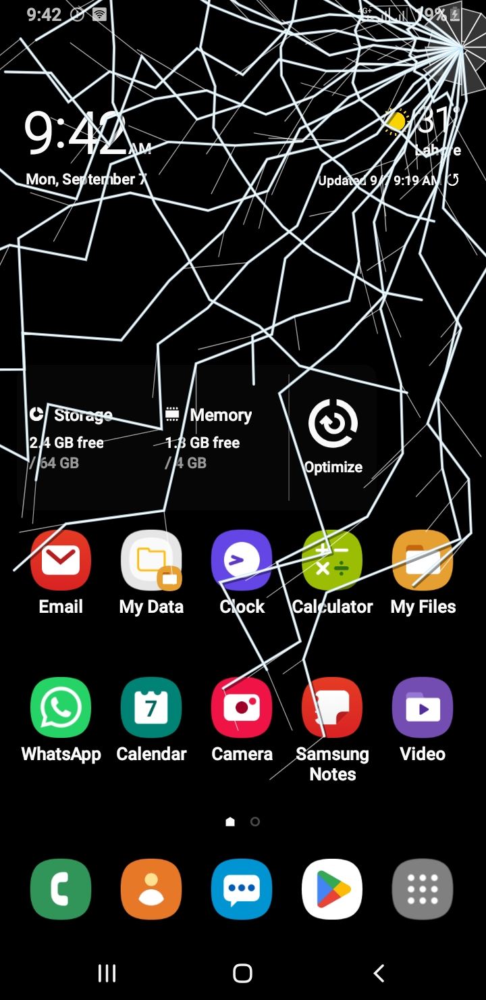

# ⚡ Fake Cracked Screen Prank

[](https://kotlinlang.org)
[](https://developer.android.com/jetpack/compose)

A modern, hyper-realistic cracked screen prank application for Android crafted with **Jetpack Compose**, **Material 3**, and **Clean Architecture**. It delivers procedural vector glass fractures, zero-latency physical acoustics, calibrated sensor triggers, and seamless system-level overlay capabilities.

> 🤖 **Built with AI assistance**: this project was developed with the help of AI tools to accelerate architecture design, code generation, and testing.

---

## 🎬 App Demo

<p align="center">
  <a href="https://youtube.com/shorts/yRIA8shxetE">
    
  </a>
</p>
*Click the screenshot above to watch the app in action on YouTube.*

---

## ✨ Features

### 🪟 Ultra-Realistic Procedural Glass Fractures
- **Multiple Fracture Styles**:
  - **Spiderweb Radial**: Classic impact point radiating dense concentric stress webs and jagged shards.
  - **Bullet Impact**: Heavy localized crushing with high-velocity shock rings and spall circles.
  - **Tempered Safety Glass**: Dense micro-crystalline fracturing across the entire viewport.
  - **Edge Fissure**: Structural perimeter fractures simulating corner drops.
- **Interactive Tap-to-Crack**: Additional localized crack branches propagate dynamically on subsequent screen taps.
- **Visual Depth & Glint**: Layered drop shadows, specular highlights, and refraction effects to simulate real optical glass depth.

### 🔊 Physical Acoustics & Tactile Haptics
- **Zero-Latency In-Memory Audio Engine**: Synthesizes 16-bit 44.1kHz PCM acoustics directly via `AudioTrack` (physical impact burst, modal resonance ringing, and tumbling micro-shards) without relying on external decoders or disk I/O.
- **Acoustic Presets**:
  - *Crisp Snap* (0.45s sharp high-frequency fracture)
  - *Bullet Impact* (0.70s explosive impact)
  - *Crystal Break* (0.85s crystalline ring)
  - *Deep Shatter* (1.05s heavy structural collapse)
- **Multi-Stage Waveform Haptics**: Synchronized vibration shockwaves mimicking the initial fracture jolt followed by micro-settling shards.

### ⏱️ Multi-Modal Activation Triggers
- **Instant Trigger**: Arm and preview directly within the application.
- **Calibrated Shake Trigger**: Uses `SensorManager` with a background low-pass acceleration filter to detect intentional shakes while ignoring pocket bumps and vehicle vibrations.
- **Timer Countdown**: Configurable delay (5s, 10s, 15s, 30s) allowing you to hand the device to a friend before the crack activates.
- **Touch / Tap Trigger**: Arms silently and shatters on the very first screen interaction.

### 📱 Full System Overlay Mode
- **Draw Over Other Apps**: Uses Android's `TYPE_APPLICATION_OVERLAY` to project the broken glass effect seamlessly across the home screen and running third-party apps.
- **Foreground Service Integration**: Managed by `PrankMonitorService` with lifecycle-safe notification controls.
- **Stealth & Safety Separation**: The tutorial exit banner appears only during in-app preview, ensuring the overlay on external apps remains 100% immersive and realistic.

### 🛡️ Fail-Safe Exit Controls
- **Triple-Tap Safe Exit**: Quick multi-tap gesture to dismiss the overlay instantly.
- **Long-Press Escape**: Emergency press-and-hold area to release the window overlay.
- **Notification Quick-Dismiss**: Foreground notification banner with a dedicated **Stop / Dismiss** action.
- **Auto-Dismiss Timer**: Optional countdown timer to automatically restore the screen after a preset duration.

---

## 🏗️ Architecture & Tech Stack

```
app/
├── data/
│   ├── audio/           # Low-latency AudioTrack physical synthesizer & haptic controllers
│   ├── overlay/         # WindowManager TYPE_APPLICATION_OVERLAY management
│   ├── sensor/          # SensorManager shake detector with low-pass filtering
│   ├── service/         # PrankMonitorService lifecycle & background controller
│   └── settings/        # Jetpack DataStore Preferences persistence
├── domain/
│   ├── audio/           # SoundPlayer contracts & presets
│   ├── model/           # Immutable domain models (CrackStyle, PrankSettings, SoundVariant)
│   ├── repository/      # Repository interface definitions
│   └── usecase/         # Clean business logic (TriggerPrankUseCase, PrankModeUseCases)
└── presentation/
    ├── common/          # Shared components & vector crack renderers
    ├── home/            # Home dashboard, arm controls, and live interactive preview
    ├── prank/           # Prank overlay screen & exit gesture handlers
    ├── settings/        # Preferences customization screens
    └── theme/           # Material Design 3 color schemes, typography, and shapes
```

### 🛠️ Core Libraries & Tools
- **UI Framework**: [Jetpack Compose](https://developer.android.com/jetpack/compose) with Material Design 3 (M3).
- **Language**: 100% [Kotlin](https://kotlinlang.org) with Coroutines & StateFlow.
- **State Persistence**: [Jetpack DataStore](https://developer.android.com/topic/libraries/architecture/datastore) (Preferences).
- **Audio HAL**: Android `AudioTrack` (raw PCM synthesis with round-robin static tracks).
- **Sensors & Services**: Android `SensorManager` (`TYPE_ACCELEROMETER`) & Foreground Service (`specialUse`).
- **Testing**: [JUnit 4](https://junit.org/junit4/) & [Robolectric](https://robolectric.org) for local JVM test suites.

---

## 🚀 Getting Started

### Prerequisites
- Android Studio Ladybug | 2024.2.1 or newer
- JDK 17 or JDK 21
- Android SDK 35 / 36
- Minimum Device Android OS: Android 7.0 (API Level 24)

### Installation & Build

1. **Clone the repository**:
   ```bash
   git clone https://github.com/alsaeeddev/android-cracked-screen-prank.git
   cd android-cracked-screen-prank
   ```

2. **Open in Android Studio**:
   Open the root project directory and allow Gradle to sync dependencies.

3. **Build via Gradle**:
   ```bash
   # Build debug APK
   ./gradlew assembleDebug

   # Run JVM unit & Robolectric tests
   ./gradlew testDebugUnitTest
   ```

4. **Run on Device or Emulator**:
   Select your connected device/emulator and click **Run (Shift + F10)**.

---

## 🔒 Permissions & Safety Notice

This application requests the following Android system permissions for operational functionality:

| Permission | Purpose |
| :--- | :--- |
| `SYSTEM_ALERT_WINDOW` | Enables displaying the cracked screen effect over external applications (`TYPE_APPLICATION_OVERLAY`). |
| `FOREGROUND_SERVICE` | Keeps the background sensor monitor active until the prank trigger occurs. |
| `FOREGROUND_SERVICE_SPECIAL_USE` | Complies with Android 14+ foreground service categorization. |
| `VIBRATE` | Drives realistic glass fracture tactile feedback. |
| `POST_NOTIFICATIONS` | Displays the persistent notification with a one-tap emergency exit action. |

> **Disclaimer**: This app is designed strictly for harmless entertainment and practical jokes with friends and family. It does not cause physical harm to device screens or hardware.

---

## 💼 Hire the Developer

Need a custom Android app, or Kotlin & Jetpack Compose development for your own project? I build production-ready Android apps end-to-end architecture, UI, and Play Store deployment.

📩 **Contact for client work / custom builds**: [@alsaeeddev](https://instagram.com/alsaeeddev) on Instagram

---
